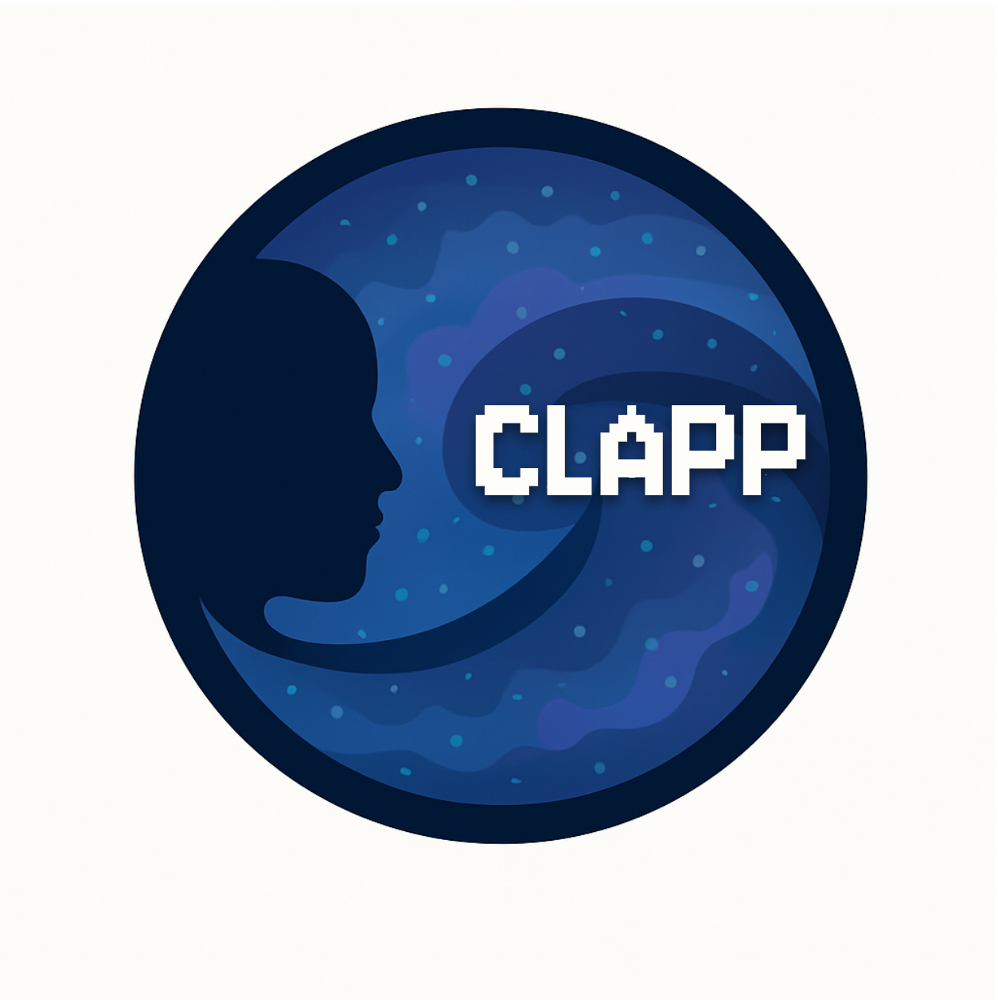

# CLAPP - CLASS LLM Agent for Pair Programming

<p align="center">
  
</p>

CLAPP is a Streamlit application that provides an AI pair programming assistant specialized in the [CLASS](https://github.com/lesgourg/class_public) cosmology code. It uses LangChain and OpenAI models, leveraging Retrieval-Augmented Generation (RAG) with CLASS documentation and code examples to provide informed responses and assist with coding tasks.

## Collaborators

* Santiago Casas
* Christian Fidler
* Julien Lesgourgues
* With contributions from: Boris Bolliet & Francisco Villaescusa-Navarro
* inspired by the [CAMELS-Agent-App](https://github.com/franciscovillaescusa/CAMELS_Agents)

## Acknowledgements

<p align="center">
  
</p>

CLAPP acknowledges the support of the [Blablador API](https://sdlaml.pages.jsc.fz-juelich.de/ai/guides/blablador_api_access/) and [Helmholtz AI](https://www.helmholtz.ai/). Especially, the help of Alex Strube with the model support!

## Features

* **Conversational AI:** Interact with an AI assistant knowledgeable about [CLASS](https://github.com/lesgourg/class_public) and cosmology.
* **CLASS Integration:** Built-in tools to test and use the [CLASS](https://github.com/lesgourg/class_public) cosmological code.
* **Code Execution:** Executes Python code snippets in real-time, with automatic error detection and correction.
* **Plotting Support:** Generates and displays cosmological plots from [CLASS](https://github.com/lesgourg/class_public) outputs.
* **RAG Integration:** Retrieves relevant information from [CLASS](https://github.com/lesgourg/class_public) documentation and code (`./class-data/`) to answer questions accurately.
* **Multiple Response Modes:** 
  * **Fast Mode:** Quick responses with good quality (recommended for most uses)
  * **Swarm Mode:** Multi-agent refined responses for more complex questions (takes longer)
* **Real-time Feedback:** Streams execution progress in real-time.
* **Model Selection:** Choose between different OpenAI models (GPT-4o, GPT-4o-mini).

## Setup and Installation

This project uses `requirements.txt` with pip/uv. CLASS (`classy`) does not install reliably with conda.

1. **Clone the repository:**
   ```bash
   git clone https://github.com/santiagocasas/clapp.git
   cd clapp
   ```

2. **Create a virtual environment and install dependencies:**
   ```bash
   uv venv .venv --python 3.11
   source .venv/bin/activate
   uv pip install -r requirements.txt
   ```

3. **API Keys:**
   * Create `.streamlit/secrets.toml` with your keys.
   * Supported entries: `OPENAI_API_KEY`, `GEMINI_API_KEY`, `BLABLADOR_API_KEY`, `BLABLADOR_BASE_URL`.
   * Get your free Gemini key from https://aistudio.google.com/app/apikey

4. **CLASS Installation:**
   * Install CLASS with `pip install classy` and verify it using the built-in test tool.

5. **CLASS Data:**
   * Ensure the `class-data` directory contains the necessary CLASS documentation, code files (.py, .ini, .txt), and potentially PDF documents for the RAG system.

6. **System Prompts:**
   * Ensure the `prompts/` directory contains the necessary instruction files (`class_instructions.txt`, `review_instructions.txt`, etc.).

## Usage

1. **Activate the virtual environment:**
   ```bash
   source .venv/bin/activate
   ```

2. **Run the Streamlit application:**
   ```bash
   streamlit run clapp/app.py
   ```

3. **Setup process:**
   * Add your API keys in `.streamlit/secrets.toml`.
   * Initialize the application by clicking "Initialize with Selected Model".
   * Check if CLASS is installed using the provided test button.
   * Start chatting with the assistant about CLASS-related questions or cosmology code.

4. **Code execution:**
   * When the assistant provides code, you can execute it by typing "execute!" in the chat.
   * The system will run the code, display the output, and show any generated plots.
   * If errors occur, the system will automatically attempt to fix them.

## Project Structure

* `CLAPP.py`: The main Streamlit application script.
* `.streamlit/secrets.toml`: Local secrets file for API keys.
* `test_classy.py`: Script to test CLASS installation and functionality.
* `requirements.txt`: Pip dependency list for local and Streamlit Cloud installs.
* `class-data/`: Directory containing data for the RAG system (CLASS code, docs, etc.).
* `prompts/`: Directory containing system prompts for the AI agents.
* `images/`: Contains images used in the app interface, including the CLAPP logo.

## Working with CLASS

CLAPP allows you to:

1. **Learn about CLASS**: Ask questions about CLASS cosmology code features, parameters, and usage.
2. **Develop cosmology code**: Get help writing code that uses CLASS for cosmological calculations.
3. **Debug and fix errors**: Get assistance with error messages and issues in your CLASS code.
4. **Visualize results**: Generate and view plots of cosmological data.
